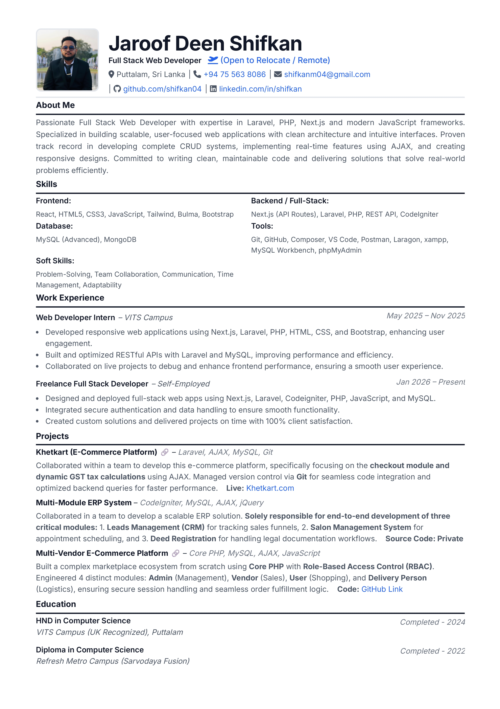

# 📄 Professional Full Stack Developer CV

This repository contains the source code for my professional CV/Resume, built using pure **HTML & CSS**. It is designed to be clean, responsive, and print-friendly (A4 size).

### 🌐 Live Demo
[Click here to view my CV Online](https://shifkan04.github.io/My-CV-/)

### 📸 CV Previews
| **With Photo** | **Without Photo** |
|:---:|:---:|
|  |  |

## 🚀 Features
- **Print Friendly:** optimized for saving as PDF.
- **Responsive:** Looks good on mobile and desktop.
- **Clean UI:** Professional layout with a focus on readability.
- **ATS Friendly:** Structured HTML content.

## 🛠️ Tech Stack
- HTML5
- CSS3 (Flexbox & Grid)
- FontAwesome Icons
- Google Fonts (Inter)

## 📥 How to Use
1. Clone the repository.
2. Open `index.html` in any web browser.
3. Press `Ctrl + P` to save as PDF.

---
**Author:** Jaroof Deen Shifkan  
[LinkedIn](https://www.linkedin.com/in/shifkan/) | [GitHub](https://github.com/shifkan04)